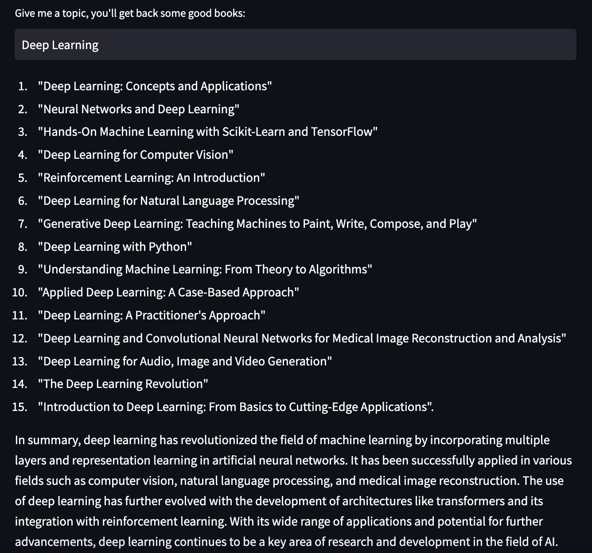
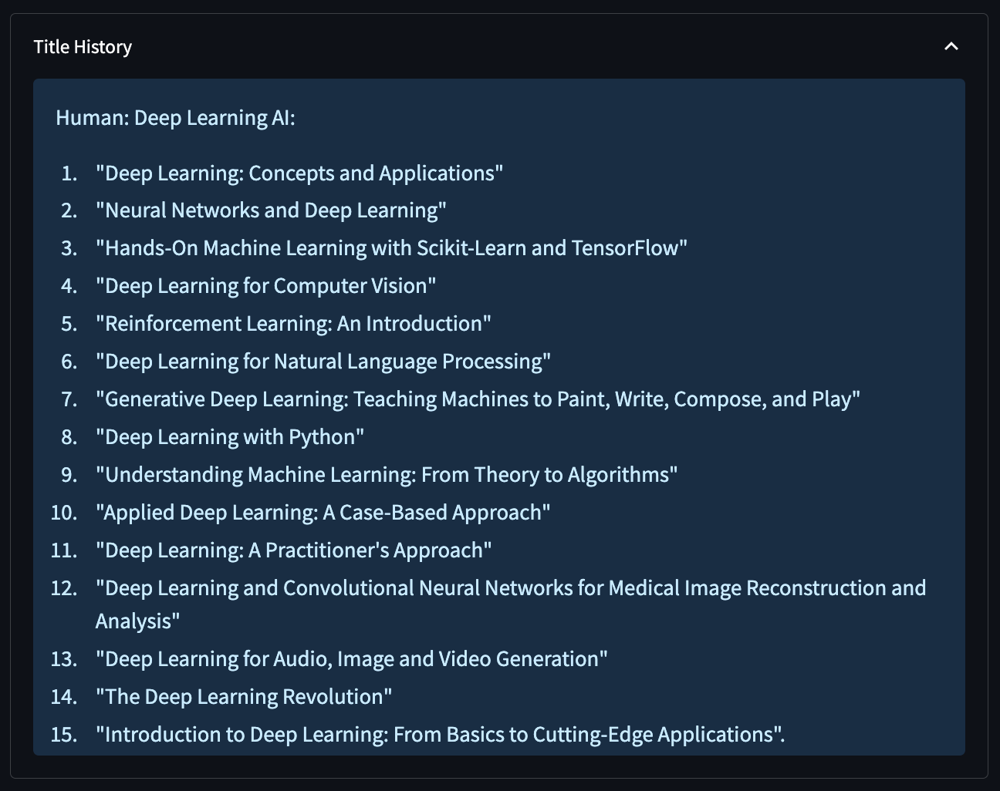
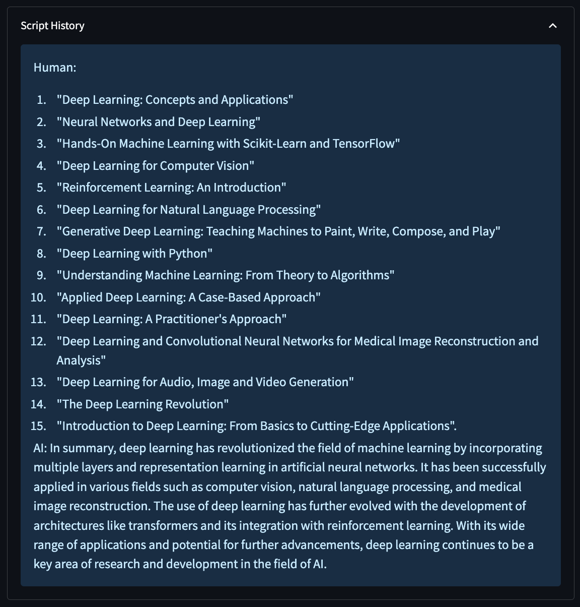
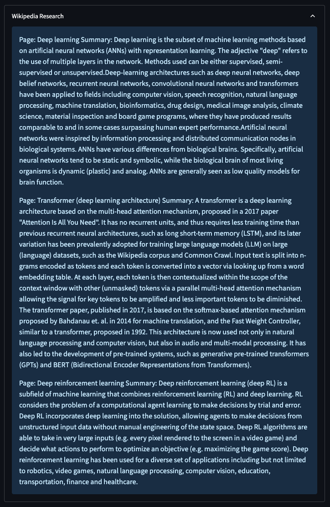

# POC: Book GPT Recommender with LangChain

- A simple book recommender app built with LangChain, Streamlit, and OpenAI API.

    

- When the user enters a topic, the recommender will give them back some book recommendations about that topic. Additionally, a Wikipedia search will also be conducted to generate a summary of the given topic based on some titles.

    

- All the chat history is logged on the screen.

    

    

    

- Inspired by __Nicholas Renotte__'s [LangChain Crash Course: Build a AutoGPT app in 25 minutes!](https://www.youtube.com/watch?v=MlK6SIjcjE8) tutorial.